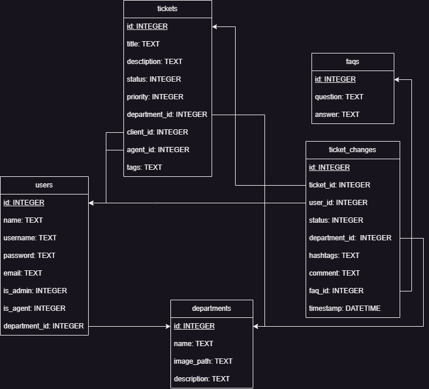

# LTW 23/23 - Ticket Manager
## Group elements

| Name  | Number | Email |
| ------------- | ------------- | ------------ |
| João Alves  | 202108670  | up202108670@up.pt  |
| Eduardo Sousa  | 202103342  | up202103342@up.pt  |
| Pedro Oliveira  | 202000149  | up202000149@up.pt  |

## Database UML

## Credentials (username / password / role)
- joaoalvesss / Batatacozida4 / admin
- phro / Brasilll6 / agent
- edsousa / Itsamemario7 / user

## List of features
- [X] Register new account
- [X] Login and Logout
- [X] Edit profile
- [X] Client submit new ticket (optional department)
- [X] Client list and tracking of tickets
- [X] Client reply to ticket
- [X] List tickets for department, agent, priority or status and sort options
- [X] Agent change ticket department
- [X] Agent assign a ticket to himself or someone else
- [X] Agent change ticket status
- [X] Agent manage FAQ and use it to answer tickets
- [X] Admin able to promote to agent or admin
- [X] Admin add new department, status and relevant entities
- [X] Admin able to assign agent to department

## Things used:

### Security:
- XSS: yes
- CSRF: yes
- SQL using prepare/execute: yes
- Passwords: created and verified with php's password_hash and password_verify

### Technologies:
- Separated logic/database/presentation: yes
- Semantic HTML tags: yes
- Responsive CSS: yes
- Javascript: yes
- Ajax: yes
- REST API: no
- Error/success messages: yes
- Forms don't lose data on error: no